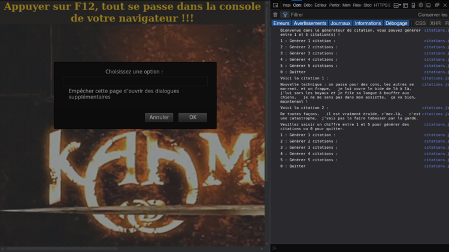

# Projet-5 : [__generateur-de-citations-en-JS__](https://openclassrooms.com/projects/imaginez-un-generateur-de-citations)

Réalisation d'un générateur de citations en JS! 

Les citations seront construites aléatoirement en assemblant des morceaux de phrase extraits de Kaamelott.

## _Etape 1 : des citations aléatoires_

Objectifs :

> Les citations sont générées aléatoirement une par une à chaque appel du programme JavaScript

> Chaque citation est la combinaison d'au moins 3 morceaux de phrases (à vous de préparer ces morceaux de phrase)

> A défaut d'être intelligible, la phrase doit être cohérente (pas de point d'exclamation au milieu d'une phrase)

Le programme peut simplement afficher le résultat dans la console JavaScript..

## _Etape 2 : des citations configurables_

Vous souhaitez maintenant aller plus loin et proposer les options suivantes :  [fichier __citations.js__](./js/citation.js)

> Choisir le nombre de citations générées (de 1 à 5)
    
    while (proposition !== "0") {....}

> Choisir entre 2 types de générateurs de citations (vous devrez donc avoir 2 ensembles de phrases)

    const typeCitation = prompt(....)

> Une fois les citations générées, proposer de générer de nouvelles citations ou d'arrêter là le programme
    
    if ((proposition >= 0) && (proposition <= 5)) {...}
    
    if (proposition === 0) {....}

Adaptez le programme pour qu'il puisse offrir ces fonctionnalités. 

## _Installation :_
Télécharger [le dossier](https://github.com/Gu1ll0m/Projet5_generateur_citations_JS)

Ouvrir le fichier __index.html__, que vous trouverez en suivant le chemin suivant `../P5/html/index.html`, dans votre navigateur `ctrl + o`

Ouvrir la console du navigateur avec `F12`

